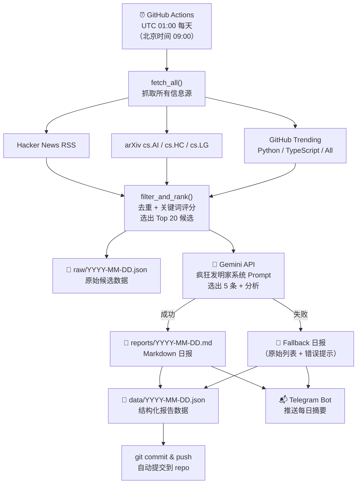

# 🔭 疯狂发明家技术雷达

> 一个 self-running inspiration engine。每天早上 9 点（北京时间）自动抓取最新技术/AI/开源内容，调用 Gemini API 分析，生成结构化 Markdown 日报，提交到 GitHub，并推送摘要到 Telegram。

你只需要：**看报告、收藏想法、偶尔反馈**。

---

## 目录

1. [系统架构](#系统架构)
2. [本地运行](#本地运行)
3. [获取 Gemini API Key](#获取-gemini-api-key)
4. [创建 Telegram Bot](#创建-telegram-bot)
5. [获取 Telegram Chat ID](#获取-telegram-chat-id)
6. [设置 GitHub Secrets](#设置-github-secrets)
7. [手动触发 GitHub Actions](#手动触发-github-actions)
8. [修改兴趣关键词](#修改兴趣关键词)
9. [项目结构](#项目结构)
10. [后续路线图](#后续路线图)

---

## 系统架构



### 信息流说明

| 步骤 | 说明 |
|------|------|
| **抓取** | 每次运行从多个 RSS + HTML 源获取最多 200 条原始条目 |
| **去重** | 标准化 URL，去除重复链接 |
| **评分** | 关键词权重打分，优先 AI/agent/creative coding 相关内容 |
| **Gemini 分析** | 将 Top 20 候选发送给 Gemini，按"疯狂发明家"视角产出 5 条精选 |
| **存储** | 三份文件：原始 JSON、日报 Markdown、结构化 JSON |
| **推送** | Telegram 消息：精选条目 + 模式总结 + 今日实验 |
| **提交** | 自动 `git commit` 生成的文件，保留历史 |

---

## 本地运行

### 前置条件

- Python 3.11+
- Git

### 步骤

```bash
# 1. 克隆 repo
git clone https://github.com/<你的用户名>/<repo名>.git
cd <repo名>

# 2. 创建虚拟环境
python -m venv .venv
source .venv/bin/activate   # Windows: .venv\Scripts\activate

# 3. 安装依赖
pip install -r requirements.txt

# 4. 配置环境变量
cp .env.example .env
# 编辑 .env，填入你的 API keys

# 5. 运行（需要真实 API keys）
python -m src.main

# 5b. 本地 Mock 模式（无需任何 API key，验证流程）
MOCK_MODE=true python -m src.main
```

运行成功后生成：

```
reports/YYYY-MM-DD.md   ← Markdown 日报（主要阅读文件）
data/YYYY-MM-DD.json    ← 结构化 JSON 数据
raw/YYYY-MM-DD.json     ← 原始候选条目
```

---

## 获取 Gemini API Key

1. 访问 [Google AI Studio](https://aistudio.google.com/app/apikey)
2. 登录 Google 账号
3. 点击 **"Create API key"**
4. 选择已有 Google Cloud 项目或新建
5. 复制生成的 key，格式类似：`AIzaSyXXXXXX...`

> **免费额度**：Gemini 1.5 Flash 每天有充足的免费请求配额，日常使用不需要付费。

---

## 创建 Telegram Bot

1. 在 Telegram 中搜索并打开 **[@BotFather](https://t.me/BotFather)**
2. 发送 `/newbot`
3. 按提示输入：
   - Bot 名称（显示名）：例如 `Tech Radar Bot`
   - Bot 用户名（唯一 ID，必须以 `bot` 结尾）：例如 `my_techradar_bot`
4. BotFather 会返回你的 **Bot Token**，格式：`1234567890:ABCdefGHIjklMNOpqrsTUVwxyz`
5. 将此 Token 保存到 `.env` 的 `TELEGRAM_BOT_TOKEN`

---

## 获取 Telegram Chat ID

### 方法一：私人对话（推送给自己）

1. 在 Telegram 中搜索你刚创建的 bot，点击 **Start**
2. 发送任意一条消息（例如 `/start`）
3. 浏览器访问：
   ```
   https://api.telegram.org/bot<你的BOT_TOKEN>/getUpdates
   ```
4. 在返回的 JSON 中找到 `"chat": {"id": 123456789, ...}`
5. 这个数字就是你的 **Chat ID**

### 方法二：群组推送

1. 将 bot 添加到群组
2. 在群里 @ bot 或发任意消息
3. 用同样的 `getUpdates` 接口获取，群组 ID 通常是负数（例如 `-1001234567890`）

---

## 设置 GitHub Secrets

1. 打开你的 GitHub repo 页面
2. 进入 **Settings → Secrets and variables → Actions**
3. 点击 **"New repository secret"**，分别添加：

| Name | Value |
|------|-------|
| `GEMINI_API_KEY` | 你的 Gemini API Key |
| `TELEGRAM_BOT_TOKEN` | 你的 Telegram Bot Token |
| `TELEGRAM_CHAT_ID` | 你的 Telegram Chat ID |

> ⚠️ **注意**：Secrets 设置后不可读取原文，请自行保存备份。

---

## 手动触发 GitHub Actions

1. 打开 GitHub repo → **Actions** 标签页
2. 左侧列表点击 **"Daily Tech Radar"**
3. 右上角点击 **"Run workflow"**
4. 可选择 `mock_mode = true`（不消耗 API 配额，用于测试流程）
5. 点击绿色 **"Run workflow"** 按钮

几分钟后刷新页面，可以看到运行结果。成功后 repo 中会出现新的日报文件，并收到 Telegram 推送。

---

## 修改兴趣关键词

编辑 `config/profile.yaml`：

```yaml
user_profile:
  interests:
    - AI agents
    - spec-driven development
    - creative coding
    # 在这里添加新关键词...

  avoid:
    - crypto hype
    # 在这里添加想过滤的词...

  max_final_items: 5      # Gemini 最终输出条目数
  max_candidates: 20      # 发送给 Gemini 的候选数量
```

修改后提交到 repo，下次运行自动生效。

---

## 添加新的信息源

编辑 `config/sources.yaml`，支持两种类型：

```yaml
sources:
  # RSS 源
  - name: My New RSS
    type: rss
    url: https://example.com/feed.xml

  # GitHub Trending（HTML 抓取）
  - name: GitHub Trending Rust
    type: html
    url: https://github.com/trending/rust?since=daily
```

---

## 项目结构

```
.
├── .env.example              ← 环境变量模板
├── .gitignore
├── requirements.txt
├── README.md
│
├── config/
│   ├── sources.yaml          ← 信息源配置（可扩展）
│   └── profile.yaml          ← 用户偏好 & 关键词
│
├── src/
│   ├── __init__.py
│   ├── main.py               ← 入口，编排整个流程
│   ├── models.py             ← Pydantic 数据模型
│   ├── utils.py              ← 工具函数（日志、日期、路径）
│   ├── fetchers.py           ← RSS + GitHub Trending 抓取
│   ├── filters.py            ← 去重、评分、筛选
│   ├── gemini_client.py      ← Gemini REST API 调用
│   ├── telegram_client.py    ← Telegram Bot 推送
│   └── storage.py            ← 文件读写
│
├── reports/                  ← 每日 Markdown 日报（自动生成）
├── data/                     ← 每日结构化 JSON（自动生成）
├── raw/                      ← 每日原始候选 JSON（自动生成）
├── feedback/
│   └── feedback.jsonl        ← 用户反馈（V2 功能预留）
│
└── .github/
    └── workflows/
        └── daily.yml         ← GitHub Actions 定时任务
```

---

## 反馈机制（V1）

在 Telegram 收到日报后，可以**回复消息**，格式：

| 格式 | 含义 |
|------|------|
| `👍 关键词` | 喜欢这类内容，希望多看 |
| `⭐ 关键词` | 想深入研究，重要收藏 |
| `👎 关键词` | 不感兴趣，后续过滤 |

> V1 阶段反馈仅作记录参考，数据结构预留在 `feedback/feedback.jsonl`。  
> V2 将接入 Telegram Webhook 自动处理反馈并调整评分权重。

---

## 后续路线图

| 优先级 | 功能 |
|--------|------|
| 🔜 | **Telegram 按钮反馈**：inline keyboard + Webhook 自动更新权重 |
| 🔜 | **每周复盘**：每周日生成 7 天热点模式汇总，自动推送 |
| 📋 | **Google Sheets 索引**：所有日报条目同步到 Sheet，方便检索 |
| 📋 | **Notion / Google Docs 同步**：日报一键导出到笔记系统 |
| 💡 | **Gemini 手动控制台**：发 Telegram 命令触发指定主题的深度分析 |
| 💡 | **个性化权重学习**：根据反馈历史自动调整关键词评分 |
| 💡 | **arXiv 摘要精读**：对高分论文调用 Gemini 生成中文精读 |
| 💡 | **Product Hunt 接入**：抓取每日产品榜，过滤 AI / dev tools 类目 |

---

## 许可证

MIT
